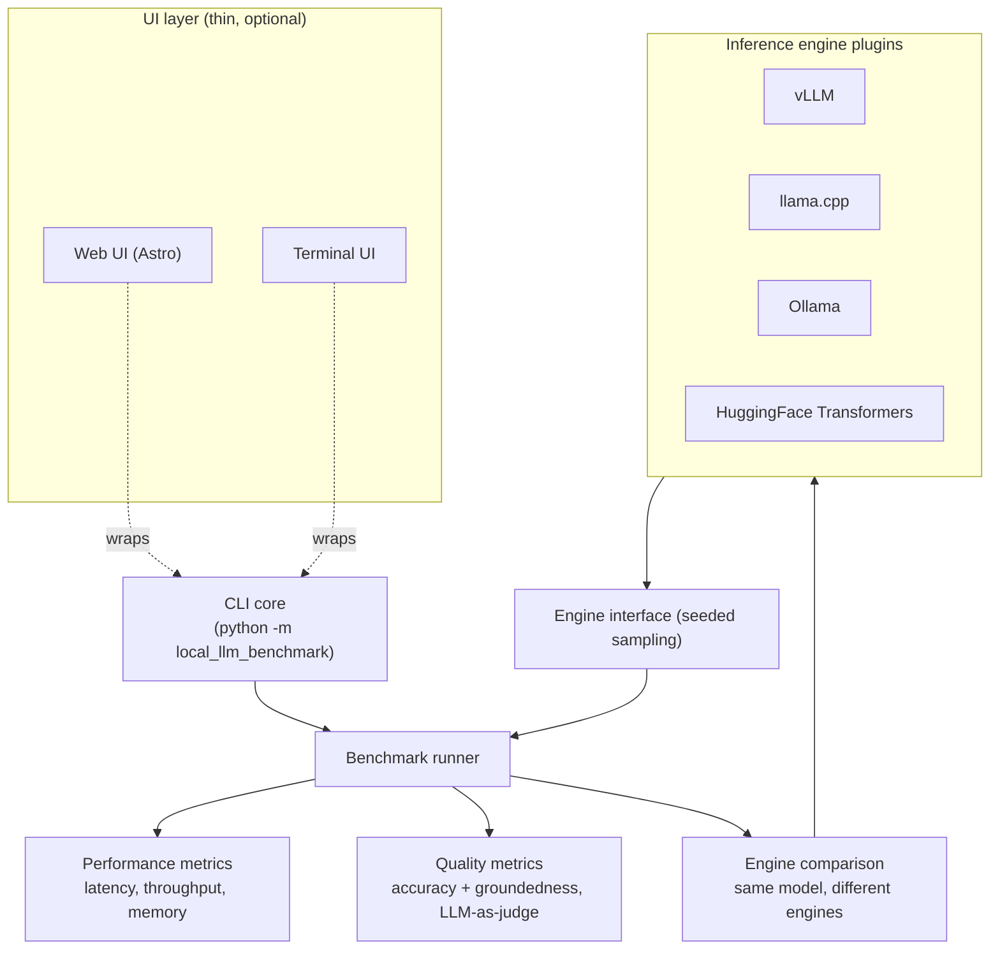

# ADR-001: Project foundation — local LLM benchmarking tool

## Context

The project is a benchmarking tool for evaluating the performance and quality of LLM models. Its
scope is defined by three pillars:

- **Model performance** is the primary focus (latency, throughput, memory, quality on benchmarks).
- **Engine comparison** is a first-class concern: the same model, run through two different inference
  engines, should be compared to answer questions like *"does engine A actually behave like engine B for
  this model?"*
- **Usability** is developer-oriented. The project lives in a cloned repository and should be usable
  straight from it, with no heavy external dependencies, and must be OS-agnostic.

The primary interface is a UI (see `## Consequences`), which sits on top of a CLI engine.

## Decision

We adopt the following foundation:

- **Language: Python.** Cross-platform out of the box, dominant ML ecosystem, and the natural home for
  LLM tooling. It keeps the "no dependencies" constraint achievable while remaining OS-agnostic.
- **Architecture: CLI core + thin UI layer.** A command-line interface is the single source of truth
  and the default way to run benchmarks. A UI (web or terminal) wraps the CLI, exposing the same
  commands and outputs. Nothing in the UI is model-specific; both share the same code path.
- **Engine abstraction.** Inference engines (vLLM, llama.cpp, Ollama, Transformers, etc.) are accessed
  through an engine plugin interface so results for the *same model* can be compared apples-to-apples.
- **Minimal dependencies.** The project ships with as few third-party packages as possible and runs
  directly from the cloned repository. Each engine is an optional, separately installed dependency.
- **Determinism by default.** Sampling is seeded so that the same model + same seed produces comparable
  outputs across engines, which is what makes the engine-comparison question answerable.

### Architecture

> [!NOTE]
> UI stack: standardized on Astro (ADR-002). Quality metrics: accuracy + groundedness (ADR-004).
> Quality comparison: LLM-as-judge (ADR-005). Engine interface: OpenAI-compatible API (ADR-003).

The CLI is the heart of the system; the UI is a presentation layer that delegates to it. This keeps
the dependency footprint low (the UI can be optional) and makes the tool usable in headless / CI
environments as well as interactively.

## Consequences

- **Usable from a clone with minimal setup.** The project runs via `python -m local_llm_benchmark`
  with no mandatory third-party packages, and is OS-agnostic (Windows, macOS, Linux).
- **Engine comparison is first-class.** Because every engine funnels through the same interface and the
  sampling is seeded, users can directly answer *"same model, two engines — same result?"* by diffing
  outputs and timings.
- **Dependency discipline.** Each engine is an optional plugin; adding or swapping an engine does not
  force users to install anything they do not need.
- **UI is a wrapper, not a parallel implementation.** Features, bug fixes, and regressions land in the
  CLI first, then propagate to the UI.
- **Scope is bounded.** We benchmark and compare; we do not build the engines themselves.

## Alternatives Considered

| Option | Description | Pros | Cons |
|--------|-------------|------|------|
| A. Python CLI + UI | CLI core with optional web/terminal UI | Cross-platform, minimal deps, huge ML ecosystem, reuse of community engines | Requires Python tooling knowledge |
| B. Native desktop app (Rust/Go) | Compiled, single binary, OS-agnostic | Fast startup, small binary | Smaller LLM ecosystem, more engine-integration work, larger tooling footprint |
| C. Framework app (Next.js/React) | Web-first UI | Modern UI, web-native | Adds Node toolchain + heavy deps, contradicts "from a clone / minimal deps", not headless-friendly |
| D. Pure terminal tool, no UI | CLI only | Minimal, fast to build | Contradicts "mainly used through a UI" |

Option A was chosen because it uniquely satisfies all constraints: it is OS-agnostic, keeps dependencies
minimal, leverages the mature Python ML ecosystem, and lets the UI remain a thin optional layer. Option
B reopens the engine-integration burden for a marginal UX gain; Option C adds a second toolchain and
heavier dependencies against the project's stated goals; Option D ignores the UI requirement.

## Open points

- These open points have been resolved: UI stack (ADR-002), engine interface (ADR-003), quality
  metrics (ADR-004), and quality comparison method (ADR-005).
- Remaining open questions are tracked in each of the above ADRs.
