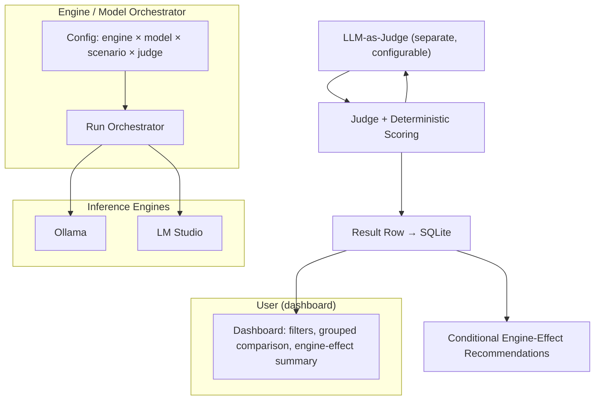

# LLM Engine & Model Benchmark — Design Document

> Companion to `llm_benchmark_plan.md`. This file captures the finalized design
> decisions from the design phase. It is the source of truth for the code
> implementation.

## 0. Status

* **Phase:** Design finalized → ready for coding (v1).
* **Primary goal:** Validate the **intrinsic performance of the LLM models** by
  running the *same models* through multiple *inference engines* and measuring the
  **engine's effect** on each model.
* **Secondary goal:** Record rich runtime + quality metrics so the user can build
  their own comparisons.

---

## 1. Core Objective (Revised)

The benchmark isolates the **effect of the engine** on a fixed model, rather than
benchmarking engine internals alone.

* We run **the same model** through each engine (Ollama, LM Studio).
* We measure both **quality** (LLM-as-judge) and **speed** independently.
* An engine is said to have a **positive or negative effect** on a model *only*
  when compared to the *other engines in the same set* — there is no absolute
  "good" baseline.
* We do **not** declare a single winner. Instead we produce **conditional
  recommendations** (e.g. "Engine A is best when speed matters; Engine B is best
  when quality matters").
* Results are **setup-specific** to this machine/config and are **not** intended
  as a public, reproducible reference for external audiences.

---

## 2. Design Decisions (Finalized)

| # | Decision | Choice |
| :--- | :--- | :--- |
| 1 | **Engines (v1)** | Ollama, LM Studio |
| 2 | **Models (v1 starter)** | Phi-3.5-mini (3.8B, coding) + Llama 3.1 8B (general) |
| 3 | **Judge (v1)** | One **general-purpose** judge model, configurable; per-challenge override |
| 4 | **Judge selection** | Cannot ship a model (judge ≠ engine being benchmarked). **Suggest** one; user configures. |
| 5 | **Judge override** | User may swap the judge at runtime; per-challenge judge override supported |
| 6 | **Challenge types (v1)** | Text-based challenges only |
| 7 | **Challenge types (backlog)** | Image generation, non-text challenges (cannot be judged by a model reliably) |
| 8 | **DB** | SQLite — store everything; compare later across time |
| 9 | **Metric axes** | Quality (LLM judge) + Speed (TTFT, thinking time, throughput), tracked independently |
| 10 | **Dashboard** | v1 — filters by model/engine/scenario/date + grouped comparisons |
| 11 | **Export (CSV/JSON)** | Backlog (nice-to-have) |
| 12 | **Engine effect** | Positive/negative only **relative to other engines in the set** |
| 13 | **Scope (v1)** | Lite version containing all core flows; everything else in backlog |

---

## 3. Engine Effect Definition

The single most important measurement. An engine `E` has an **effect** on model `M`
computed as the delta between `E` and the engine set baseline.

**Quality axis (LLM-as-judge score, 1–5):**
- `ΔQuality = Score(M, E) − median(Score(M, all_engines))`
- Effect is **positive** if `ΔQuality > 0`, **negative** if `ΔQuality < 0`.

**Speed axis (latency/throughput):**
- Lower latency / higher throughput → **positive** effect on speed.
- Higher latency / lower throughput → **negative** effect on speed.

**Recommendation output (per model):**
- "Use Engine X when speed matters" — best median throughput.
- "Use Engine Y when quality matters" — best median judge score.

> Note: engine overhead (quantization, kernel choices) can perturb a model's
> *outputs* even for identical weights and params — this is exactly what the judge
> axis is meant to capture.

---

## 4. Benchmark Scenarios (v1 — text challenges)

Text challenges are grouped so that some are judged by an LLM and some by
deterministic checks.

| Category | Scenario | Judge | Success metric |
| :--- | :--- | :--- | :--- |
| **General** | Short Text Prompt | LLM judge | Instruction adherence |
| **General** | Long Document Query (500–1000 words + question) | LLM judge | Retrieval accuracy |
| **General** | Sentiment / Tone Analysis | Deterministic (Positive/Negative/Neutral) | Classification accuracy |
| **General** | Constraint Satisfaction | LLM judge | Multi-constraint adherence |
| **General** | Structured Data Extraction → JSON/XML | Deterministic (JSON schema) | Parse success / schema validity |
| **Coding** | Code Generation / Analysis | LLM judge + unit tests | Syntax adherence + test pass rate |

> Image-generation and other non-text challenges are in the **backlog** because
> their outputs cannot be reliably judged by an LLM today.

---

## 5. LLM-as-Judge Design

### 5.1 Judge placement
* The judge is **not** one of the engines being benchmarked.
* It is **suggested** as a default (strong general-purpose model) and fully
  **configurable** by the user.
* Supports a **per-challenge override** (e.g. a different judge for coding).

### 5.2 Suggested default judge
* **General:** a strong closed model (e.g. GPT-4o-class) **or** a large local
  model (e.g. Qwen2.5 72B) for fully self-hosted setups.
* The judge is called via the **same OpenAI-compatible interface** so the
  framework stays uniform.

### 5.3 Quality rubric (fixed set, 1–5 scale)
Each judged output is scored on:
1. **Factual correctness** — accuracy against the prompt's premise.
2. **Instruction adherence** — did it follow the requested format/constraints?
3. **Constraint satisfaction** — strict multi-constraint compliance.

Coding challenges additionally run **unit tests**; results feed a combined
coding score (judge + test pass rate).

---

## 6. Metrics

| Metric | Axis | Used to pick winner? |
| :--- | :--- | :--- |
| LLM-judge quality score (1–5) | Quality | Yes (relative) |
| Deterministic success (schema/tests) | Quality | Yes (relative) |
| Time-to-first-token (TTFT) | Speed | No (recorded only) |
| Thinking/processing time | Speed | No (recorded only) |
| Total throughput (tokens/s) | Speed | Yes (relative) |
| Total latency (ms) | Speed | Yes (relative) |
| Token counts (in/out) | Efficiency | No (recorded only) |

Infra metrics (TTFT, thinking time) are recorded to let the user build their own
comparisons but are **not** the primary signal for engine-effect ranking.

---

## 7. Data Schema (SQLite)

Every run logs the following structured fields (supersede the plan's original
fields):

| Field | Type | Source | Purpose |
| :--- | :--- | :--- | :--- |
| `run_id` | Integer | System | Unique run identifier |
| `run_timestamp` | DateTime | System | When the run occurred (for cross-time comparison) |
| `engine` | String | Engine config | Ollama / LM Studio |
| `model_id` | String | Engine config | e.g. `phi-3.5-mini` |
| `scenario` | String | Scenario | Which test |
| `input_text_length` | Integer | Pre-processing | Input length (chars) |
| `input_tokens` | Integer | API response | Prompt tokens |
| `output_tokens` | Integer | API response | Completion tokens |
| `response_latency_ms` | Float | API response | Total latency |
| `ttft_ms` | Float | API response | Time to first token |
| `thinking_time_ms` | Float | API response | Thinking/processing time |
| `throughput_toks_s` | Float | Computed | Tokens per second |
| `judge_score` | Float | LLM judge | 1–5 quality |
| `judge_dimension_*` | Float | LLM judge | Per-dimension scores |
| `deterministic_success` | Boolean | Deterministic check | Parse/test success |
| `parse_error_type` | String | Deterministic | Error type if failed |
| `engine_effect_quality` | Float | Computed | ΔQuality vs engine median |
| `engine_effect_speed` | String | Computed | Positive / Negative / Neutral |

---

## 8. v1 Scope vs Backlog

| In v1 | Backlog |
| :--- | :--- |
| Ollama + LM Studio engines | Additional engines (vLLM, HF Transformers, OpenAI gateway) |
| Phi-3.5-mini + Llama 3.1 8B | User-importable models (later) |
| Text challenges (6 scenarios) | Image + non-text challenges |
| Single configurable judge | Multiple specialized judges |
| SQLite storage | Data warehouse / sync |
| Dashboard with filters + grouped comparisons | CSV/JSON export |
| Engine-effect recommendation output | Public/reproducible benchmark standard |

---

## 9. High-Level Framework (v1)

### Framework contract (what to show before coding)
Before writing the full implementation, the following components must be shown:
1. **Engine adapter interface** — a unified OpenAI-compatible contract that both
   Ollama and LM Studio implement.
2. **Orchestrator** — drives the engine × model × scenario matrix.
3. **Scoring** — deterministic checks + LLM-as-judge pipeline.
4. **Storage** — SQLite schema and writer.
5. **Dashboard** — filtered, grouped comparisons + engine-effect summary.
6. **Recommendation engine** — conditional best-per-scenario output.
